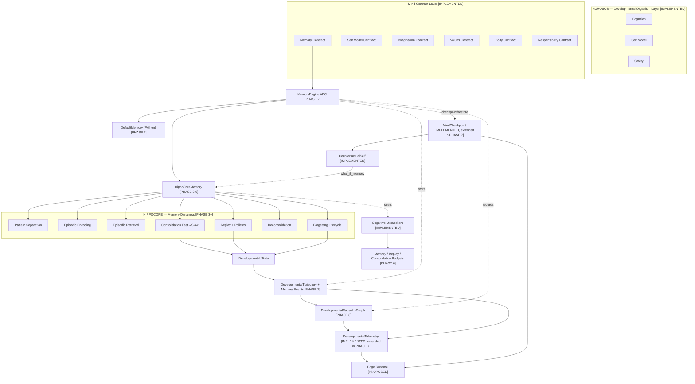

# HippoCore Integration Audit — NurosOS Memory Subsystem

> Audit scope: every file that defines, implements, references, or consumes
> NurosOS's memory abstractions. Integration goal: add a "HippoCore" engine
> (episodic memory, pattern separation, replay, consolidation,
> reconsolidation, forgetting) **behind** NurosOS's existing memory contract,
> without creating a competing memory system.
>
> Methodology: every positive claim below is anchored to a `file:line` citation.
> Absent features are marked `NOT FOUND` after exhaustive `grep` across the
> repo for the corresponding keyword (case-insensitive). Skeptical posture:
> contradictions between docs and code are reported as findings, not glossed.

---

## 1. Existing Memory Abstractions

The NurosOS memory surface is **not a single class**. There are **three
parallel, non-unified memory subsystems**:

1. The Python cognitive **`MemoryContract`** (the documented Mind Contract
   Layer Contract 1).
2. The Rust `MemoryRecord` struct embedded inside `MinimumOrganism::state`
   (the developmental substrate's memory).
3. The Rust kernel-level **`Ams`** (Associative Memory Store, the
   "no-filesystem" content-addressable storage).

They do not reference each other. This is the single most important fact for
HippoCore integration.

### 1.1 `MemoryContract` (Python, cognitive layer)

- **Name & location**: `MemoryContract`, `nuros/memory.py:118-336`.
- **Constructor**: `__init__(self, epistemic_kernel: Optional[EpistemicKernel] = None)` — `nuros/memory.py:128`.
- **Public methods** (signatures as actually implemented; see §11 for spec drift):

| Method | Signature | Location |
|---|---|---|
| `remember` | `(content, memory_type=EPISODIC, origin="", provenance="", confidence=1.0, importance=0.5, context=None, tags=None) -> MemoryEntry` | `nuros/memory.py:135-160` |
| `retrieve` | `(query=None, memory_type=None, min_confidence=0.0, min_importance=0.0, tags=None, limit=10) -> list[MemoryEntry]` | `nuros/memory.py:162-187` |
| `retrieve_by_id` | `(memory_id) -> Optional[MemoryEntry]` | `nuros/memory.py:189-194` |
| `associate` | `(memory_id_a, memory_id_b, relation_type="semantic", strength=1.0, bidirectional=True) -> bool` | `nuros/memory.py:196-214` |
| `reflect` | `(memory_id) -> Optional[dict]` | `nuros/memory.py:216-233` |
| `revise` | `(memory_id, field_name, new_value, justification, author="system") -> Optional[MemoryEntry]` | `nuros/memory.py:235-251` |
| `reconsolidate` | `(memory_id, reward=0.0) -> Optional[MemoryEntry]` | `nuros/memory.py:253-266` |
| `forget` | `(memory_id, justification="") -> bool` | `nuros/memory.py:268-280` |
| `replay` | `(memory_type=None, tags=None, time_range=None) -> list[MemoryEntry]` | `nuros/memory.py:282-300` |
| `working_set` | `(key, value) -> None` | `nuros/memory.py:302-306` |
| `working_get` | `(key) -> Optional[Any]` | `nuros/memory.py:308-309` |
| `memory_count` | property -> int | `nuros/memory.py:311-313` |
| `operation_log` | property -> list[tuple[MemoryOperation, str, float]] | `nuros/memory.py:315-317` |
| `summary` | `() -> dict` | `nuros/memory.py:322-335` |

- **Internal data structures**:
  - `self._memories: dict[str, MemoryEntry]` — `nuros/memory.py:129`. Plain `dict`, keyed by random UUID `memory_id`. **Not content-addressed, no similarity index, no thread lock**.
  - `self._epistemic: EpistemicKernel` — `nuros/memory.py:130`. Used only for default-label factory; not stored per-memory beyond the `epistemic_label` field.
  - `self._operation_log: list[tuple[MemoryOperation, str, float]]` — `nuros/memory.py:131`. Append-only.
  - `self._working_memory: dict[str, Any]` — `nuros/memory.py:132`. Fixed-capacity FIFO, capacity `7` (`nuros/memory.py:133`).

### 1.2 `MemoryEntry` (per-record schema)

- **Name & location**: `MemoryEntry`, `nuros/memory.py:76-115`. `@dataclass`.

| Field | Type | Default | Line |
|---|---|---|---|
| `memory_id` | `str` | `uuid.uuid4()` | `nuros/memory.py:78` |
| `content` | `Any` | `None` | `nuros/memory.py:79` |
| `memory_type` | `MemoryType` | `EPISODIC` | `nuros/memory.py:80` |
| `origin` | `str` | `""` | `nuros/memory.py:81` |
| `timestamp` | `float` | `time.time()` | `nuros/memory.py:82` |
| `provenance` | `str` | `""` | `nuros/memory.py:83` |
| `confidence` | `float` | `1.0` | `nuros/memory.py:84` (validated `[0,1]` at `:96-97`) |
| `context` | `dict[str, Any]` | `{}` | `nuros/memory.py:85` |
| `importance` | `float` | `0.5` | `nuros/memory.py:86` (validated `[0,1]` at `:98-99`) |
| `prediction_error` | `float` | `0.0` | `nuros/memory.py:87` |
| `epistemic_label` | `EpistemicLabel` | `REMEMBERED` | `nuros/memory.py:88` |
| `decay_rate` | `float` | `0.001` | `nuros/memory.py:89` |
| `access_history` | `list[MemoryAccess]` | `[]` | `nuros/memory.py:90` |
| `relationships` | `list[MemoryRelationship]` | `[]` | `nuros/memory.py:91` |
| `revision_history` | `dict[str, MemoryRevision]` | `{}` | `nuros/memory.py:92` |
| `tags` | `set[str]` | `set()` | `nuros/memory.py:93` |

- **Computed properties**:
  - `access_count` -> int — `nuros/memory.py:101-103`.
  - `current_strength` -> float — `nuros/memory.py:106-110`. Formula: `importance * confidence * exp(-decay_rate * age) * (1 + min(1, access_count * 0.05))`. This is the priority/forgetting signal.
- **Methods**: `record_access(operation, accessor="")` — `nuros/memory.py:112-115`.

### 1.3 Supporting Python dataclasses / enums

- `MemoryType` enum (5 values: EPISODIC, SEMANTIC, PROCEDURAL, WORKING, COUNTERFACTUAL) — `nuros/memory.py:30-35`.
- `MemoryOperation` enum (8 values: REMEMBER, RETRIEVE, ASSOCIATE, REFLECT, REVISE, RECONSOLIDATE, FORGET, REPLAY) — `nuros/memory.py:38-46`.
- `MemoryAccess` dataclass (`timestamp, operation, accessor`) — `nuros/memory.py:49-53`.
- `MemoryRevision` dataclass (`revision_id, timestamp, field_modified, old_value, new_value, justification, author`) — `nuros/memory.py:56-64`.
- `MemoryRelationship` dataclass (`target_id, relation_type, strength, bidirectional`) — `nuros/memory.py:67-72`.

### 1.4 `MemoryRecord` (Rust, developmental substrate)

- **Name & location**: `MemoryRecord`, `nuros-dev/src/organism.rs:30-42`.
- **Schema** (much simpler than `MemoryEntry`):

| Field | Type | Comment |
|---|---|---|
| `key` | `String` | canonical-JSON signature of observation, truncated to 64 chars (`organism.rs:588-596`) |
| `value` | `serde_json::Value` | `{action, reward, prediction_error}` (`organism.rs:223-227`) |
| `importance` | `f64` | `(|reward| + 0.1).min(1.0)` (`organism.rs:228`) |
| `step` | `u64` | tick at which memory was formed |
| `access_count` | `u64` | initialized to 0 at write (`organism.rs:230, 345`); **never incremented anywhere** (grep on `access_count` returned no mutation site). Dead field. |

- **Storage**: `OrganismState.memory: Vec<MemoryRecord>` — `nuros-dev/src/organism.rs:67`. A flat growable Vec, hard-capped at 200 (`organism.rs:233-236`); when full, the Vec is sorted by `importance` descending and truncated — see §3.
- **No relation/association storage at the Rust level.** No `MemoryRelationship` equivalent in `MemoryRecord`.

### 1.5 `Ams` (Rust, kernel-layer Associative Memory Store)

- **Name & location**: `Ams`, `kernel/src/mem.rs:54-125`.
- **Public API**:
  - `store(stimulus: Vec<f32>, payload: Vec<u8>) -> Handle` — `kernel/src/mem.rs:75-84`.
  - `query(partial_stimulus: &[f32], k: usize) -> Vec<(Handle, f32)>` — `kernel/src/mem.rs:93-102`. Cosine similarity (`kernel/src/mem.rs:136-150`).
  - `read(h: Handle) -> Option<Vec<u8>>` — `kernel/src/mem.rs:108-111`.
  - `reinforce(h: Handle, reward: f32)` — `kernel/src/mem.rs:119-124`. Dopamine-modulated Hebbian update.
- **Internal data structures**:
  - `inner: RwLock<HashMap<Handle, Entry>>` — `kernel/src/mem.rs:56`. **Thread-safe** (unlike `MemoryContract`).
  - `next_handle: AtomicU64` — `kernel/src/mem.rs:58`.
  - `Entry { stimulus: Vec<f32>, payload: Vec<u8>, reinforcement: f32 }` — `kernel/src/mem.rs:39-47`.
  - `Handle(pub u64)` — `kernel/src/mem.rs:36`. Opaque, no global namespace.
- The `Ams` is described as a software analog of the *Drosophila* mushroom body (`kernel/src/mem.rs:1-26`). It is content-addressable for **retrieval** but does **no pattern separation** at store time — see §3.

### 1.6 Other memory-relevant abstractions

- **`MindSnapshot`** (Python, `nuros/version_control.py:32-57`): carries `memory_hash: str` (line 41) + free-form `state_data: dict[str, Any]` (line 46). Only a hash of memory is preserved, not the contents. Composite hash combines `genome_hash:memory_hash:state_hash:developmental_hash` (`version_control.py:54-57`).
- **`MindCheckpoint`** (Rust, `nuros-dev/src/checkpoint.rs:28-105`): carries `organism_state: OrganismState` (line 47), which embeds `memory: Vec<MemoryRecord>` (`organism.rs:67`). Full memory contents are preserved. See §7.
- **`EpistemicKernel`** (Python, `nuros/epistemic.py:250-383`): consulted by `MemoryContract.__init__` (memory.py:130). The kernel's `EpistemicRepresentation.provenance: list[EpistemicTransition]` (`epistemic.py:143`) provides a transition chain — but `MemoryEntry` does NOT embed `EpistemicRepresentation`; it only stores `epistemic_label: EpistemicLabel` (memory.py:88), losing the transition chain.

### 1.7 Capability support matrix

| Capability | Python `MemoryContract` | Rust `MemoryRecord` (in `MinimumOrganism`) | Rust `Ams` |
|---|---|---|---|
| encode | YES — `remember()` `memory.py:135` | YES — `state.memory.push(...)` `organism.rs:221` | YES — `store()` `mem.rs:75` |
| retrieve | YES — `retrieve()` `memory.py:162`, `retrieve_by_id()` `memory.py:189` | NO (Vec scan only, no helper) | YES — `query()` `mem.rs:93`, `read()` `mem.rs:108` |
| replay | PARTIAL — `replay()` `memory.py:282` (filter+sort, no re-encode) | NO | NO |
| consolidate | NO (only single-memory `reconsolidate()` `memory.py:253`; see §4) | NO | NO (but `store()` is named "consolidation" in docstring `mem.rs:72`) |
| forget | YES — `forget()` `memory.py:268`, **but hard-deletes** (see §9) | PARTIAL — `truncate(200)` by importance `organism.rs:233-236` (silently drops) | NO |
| checkpoint | NO (only `summary()` `memory.py:322`; full-state checkpointing not implemented) | YES — embedded in `MindCheckpoint` `checkpoint.rs:47` | NO (no snapshot method) |
| reconsolidate | YES — `reconsolidate()` `memory.py:253` (single-memory) | NO | PARTIAL — `reinforce()` `mem.rs:119` updates reinforcement score only |
| pattern separation | NOT FOUND (see §3) | NOT FOUND (opposite: eviction-by-importance `organism.rs:233-236`) | NOT FOUND (cosine at retrieval only) |
| association | YES — `associate()` `memory.py:196`, `MemoryRelationship` `memory.py:67` | NO | NO (but `store()` creates implicit stimulus↔payload association) |
| provenance | PARTIAL — free-form `origin`, `provenance`, `context` fields `memory.py:80-85` (see §5) | PARTIAL — `key` (observation signature) + `step` only `organism.rs:30-42` | NO (no provenance fields) |
| priority | YES — `importance` `memory.py:86` + `current_strength` `memory.py:106-110`; `retrieve()` sorts by strength `memory.py:185` | PARTIAL — `importance` `organism.rs:37`, used only for truncation `organism.rs:233-236` | YES — `reinforcement` `mem.rs:46` |

---

## 2. Episodic / Semantic / Consolidated distinction

- NurosOS declares the distinction at the **type-label level only**: `MemoryType` enum has `EPISODIC`, `SEMANTIC`, `PROCEDURAL`, `WORKING`, `COUNTERFACTUAL` (`nuros/memory.py:30-35`).
- **No storage-level separation.** All five types live in the same flat `self._memories: dict[str, MemoryEntry]` (`nuros/memory.py:129`). There is no "fast episodic buffer" vs "slow consolidated store".
- **No fast→slow transfer pipeline.** `MemoryContract.reconsolidate(memory_id, reward)` (`nuros/memory.py:253-266`) operates in-place on a single memory, modulating `importance`, `confidence`, `decay_rate`. It does not produce a new SEMANTIC memory from a cluster of EPISODIC ones.
- The Rust `MemoryRecord` (`nuros-dev/src/organism.rs:30-42`) has **no `memory_type` field at all** — there is no episodic/semantic distinction in the developmental substrate.
- The closest existing structure to "consolidation" is `Organism.sleep()` (`nuros/organism.py:238-247`): it calls `self._memory.replay()` then `self._memory.reconsolidate(mem.memory_id, reward=0.01)` for the first 10 memories. This is importance-bumping within the same flat store, not a fast→slow transfer.
- The Whitepaper references `syscall::memory::consolidate()` (`WHITEPAPER.md:256`) as a future "sleep cycle" syscall — but this is a design sketch, NOT implemented anywhere in the codebase (grep for `memory::consolidate` returns only the whitepaper mention).
- The `LifecycleState` enum (`nuros/homeostasis.py:30-36`) declares a `CONSOLIDATE` state, but no organism state machine ever transitions to it (grep shows `LifecycleState.CONSOLIDATE` is referenced only at definition site).

**Conclusion**: the episodic/semantic distinction is purely a label. HippoCore's fast-episodic-vs-slow-consolidated storage would be **net new structure** — there is no existing separation to plug into.

---

## 3. Pattern Separation

**NOT FOUND.** No mechanism prevents similar experiences from overwriting or merging with each other. Specifics:

- `MemoryContract.remember()` (`nuros/memory.py:135-160`) generates a fresh `uuid.uuid4()` for every call (`nuros/memory.py:78`). Two calls with byte-identical `content` produce two distinct `MemoryEntry`s. There is **no similarity check, no sparse coding, no contextual tag deduplication, no hash-based dedup**.
- `MemoryContract.retrieve()` (`nuros/memory.py:162-187`) does substring matching on `entry.content` if it's a string (`memory.py:181`) — this is a query filter, not a separation mechanism.
- The Rust `MinimumOrganism.tick()` (`nuros-dev/src/organism.rs:219-236`) pushes a new `MemoryRecord` every tick with `key = observation_signature(obs.payload)` (canonical JSON truncated to 64 chars, `organism.rs:588-596`). The signature is a content hash, but **`push` does not check whether a record with the same key already exists** — they accumulate. When `state.memory.len() > 200` (`organism.rs:233`), the Vec is sorted by `importance` descending and truncated to 200 (`organism.rs:234-235`). This is the **opposite of pattern separation**: low-importance memories are silently evicted, regardless of similarity to surviving entries.
- The Rust `Ams` (`kernel/src/mem.rs`) uses cosine similarity for **retrieval** (`mem.rs:93-102, 136-150`) but `store()` (`mem.rs:75-84`) returns a new `Handle` every time without checking for near-duplicates. So the AMS supports pattern **completion** at retrieval but not pattern **separation** at storage.
- Grep across the repo for `pattern_separation`, `pattern separation`, `sparse cod`, `orthogonaliz`, `dedup`, `deduplication` (case-insensitive) returned **no matches** in any source file.

**Conclusion**: HippoCore's pattern separation capability is **net new** — there is no existing NurosOS mechanism to wrap or extend.

---

## 4. Replay & Consolidation

- **Replay as a developmental mechanism**: PARTIALLY implemented, weakly.
  - `Organism.sleep()` (`nuros/organism.py:238-247`) sets `OrganismState.SLEEPING` (`organism.py:240`) and then calls `self._memory.replay()` (returns all memories, sorted by timestamp) and reconsolidates the first 10 with `reward=0.01` (`organism.py:244-247`). This is the **only developmental use of replay** in the Python layer.
  - The Rust developmental substrate has a separate `replay_from_checkpoint()` function (`nuros-dev/src/checkpoint.rs:174-237`) — but this is **deterministic replay for reproducibility verification** (it re-runs `MinimumOrganism::tick()` from a saved state and compares the resulting trajectory against the original). It is NOT replay-as-consolidation; it does not touch memory contents beyond what `tick()` itself does.
  - `MemoryContract.replay()` (`nuros/memory.py:282-300`) is a **query** (filter by `memory_type`/`tags`/`time_range`, sort by timestamp). It does not re-encode, does not generate, does not call `reconsolidate`. Sleep → reconsolidate is the only replay→mutation link, and it is hardcoded to a 0.01 reward and a 10-memory cap.

- **Fast→slow consolidation pipeline**: NOT FOUND.
  - No method in `MemoryContract` derives a SEMANTIC memory from a cluster of EPISODIC memories.
  - `reconsolidate()` (`nuros/memory.py:253-266`) is per-memory and only adjusts scalar fields (`importance`, `confidence`, `decay_rate`).
  - The Rust `MemoryRecord` has no `memory_type` field (`organism.rs:30-42`), so a fast→slow distinction cannot even be expressed.
  - Grep for `consolidat` returns only: the `reconsolidate` method (memory.py:253), the AMS docstring "Mimics the consolidation of a memory trace" (`mem.rs:72`), the homeostasis `CONSOLIDATE` enum value (`homeostasis.py:34`, never used), the `self_model_consolidation_rate` aging parameter (`aging.rs:80`, structurally consolidates self-model stability, NOT memory), and the whitepaper syscall sketch (`WHITEPAPER.md:256`, not implemented).

**Conclusion**: HippoCore's replay (offline, generative, fast→slow) and consolidation (episodic→semantic transfer) capabilities are **net new**. The existing `Organism.sleep()` hook is a usable entry point but only nudges a flat dict.

---

## 5. Provenance

- A memory record **can** answer "what content" and "what timestamp" via `MemoryEntry.content` (`memory.py:79`) and `MemoryEntry.timestamp` (`memory.py:82`).
- It **can** answer "what-organism" / "what-environment" / "what-action" / "what-outcome" **only if the caller populated the free-form fields** `origin` (`memory.py:81`), `provenance` (`memory.py:83`), or `context` (`memory.py:85`). There is **no schema enforcement** — these are all `str` / `dict[str, Any]`.
- There is **NO `MemoryProvenance` concept**. Grep for `MemoryProvenance` returned **no matches** in the entire repo.
- The Rust `MemoryRecord` (`nuros-dev/src/organism.rs:30-42`) is even thinner: `value = {action, reward, prediction_error}` (`organism.rs:223-227`). It answers what-action and what-outcome only. No organism, environment, or "where" dimensions.
- The Rust `Ams.Entry` (`kernel/src/mem.rs:39-47`) has only `stimulus`, `payload`, `reinforcement` — no provenance fields at all.
- The `EpistemicKernel`'s `EpistemicRepresentation` (`nuros/epistemic.py:128-247`) DOES carry a structured `provenance: list[EpistemicTransition]` chain (`epistemic.py:143`), but `MemoryEntry` does **not** embed an `EpistemicRepresentation` — it only stores `epistemic_label: EpistemicLabel` (`memory.py:88`), losing the transition audit trail. The transition chain is reachable only by re-deriving it through the kernel.
- The Rust `DevelopmentalCausalityGraph` (`nuros-dev/src/causality.rs:73-200`) is a provenance DAG with `EventKind::MemoryUpdate` (`causality.rs:33`) — but `MinimumOrganism::tick()` does NOT call `DevelopmentalCausalityGraph::record(...)` (grep confirmed: `EventKind::MemoryUpdate` is defined but never used in a `record()` call). The causality graph is built but the organism does not populate it. See §6.

**Conclusion**: HippoCore provenance (where/when/what-experience/what-organism/what-environment/what-action/what-outcome) would need a structured provenance object. NurosOS has the *fields* on `MemoryEntry` but no schema; HippoCore can introduce a `MemoryProvenance` dataclass that populates `MemoryEntry.context` without breaking the contract.

---

## 6. Memory → Developmental Trajectory link

- **Does the developmental trajectory record memory events (MEMORY_ENCODED, MEMORY_RETRIEVED, etc.)? NO.**
  - Grep for `MEMORY_ENCODED`, `MEMORY_RETRIEVED`, `MEMORY_REPLAYED`, `MEMORY_CONSOLIDATED` returned **no matches** anywhere in the repo.
  - The Rust `DevelopmentalTrajectory` (`nuros-dev/src/trajectory.rs:59-138`) records `TrajectoryPoint` (`trajectory.rs:18-38`) per tick. Each point has `memory_size: u64` (`trajectory.rs:32`) — only the **count**, never the contents or per-memory events.
  - The Rust `DevelopmentalEvent` (`trajectory.rs:157-169`) has a free-form `kind: String` (`trajectory.rs:160`), but the only producer (`MinimumOrganism::tick()` and `apply_maturation()` at `organism.rs:507-528`) never records memory-related events.
  - The Python `DevelopmentEngine` (`nuros/development.py:71-187`) records `_plasticity_events: list[PlasticityEvent]` (`development.py:85`) and `_stage_transitions` (`development.py:88`) — but does NOT record any memory operation events. `DevelopmentalCheckpoint.metrics: dict[str, float]` (`development.py:46`) is free-form but never includes memory event counts.
  - The Rust `DevelopmentalCausalityGraph` (`nuros-dev/src/causality.rs:73-200`) defines `EventKind::MemoryUpdate` (`causality.rs:33`), but no caller in the codebase ever invokes `DevelopmentalCausalityGraph::record(..., EventKind::MemoryUpdate, ...)`. Grep confirmed: the only uses of `EventKind::MemoryUpdate` are at the enum definition. The causality graph is **wired but not driven** by the organism's memory operations.

- **Indirect links**:
  - `Organism.snapshot()` (`nuros/organism.py:301-317`) includes `"memory": self._memory.summary()` (`organism.py:311`) — summary stats only.
  - `Organism.state_hash()` (`nuros/organism.py:290-299`) includes `memory_count` (`organism.py:296`) — only the count goes into the hash. Memory **contents** do not affect `state_hash`, so two organisms with the same developmental state but different memory contents would have the **same `state_hash`**. This is a significant reproducibility gap.
  - `Organism.tick()` (`nuros/organism.py:178-211`) does NOT call any `self._memory.*` method — the cognitive-layer organism does not encode observations into memory during `tick()`. Memory encoding happens only in the explicit organism subclasses (`organisms/organism_0.py:56`, `organism_1.py:53,65`, `organism_2.py:51,73`, `organism_3.py:60`, `organism_4.py:49,68,80`, `organism_5.py:55`).

**Conclusion**: HippoCore would need to add a memory-event emit hook into the developmental trajectory. The `DevelopmentalCausalityGraph.EventKind::MemoryUpdate` is already defined and waiting for a producer; the Python `DevelopmentEngine` has no equivalent and would need extension.

---

## 7. Memory Checkpointing

- **Rust (developmental substrate)**: `MindCheckpoint.organism_state: OrganismState` (`nuros-dev/src/checkpoint.rs:47`) embeds `OrganismState.memory: Vec<MemoryRecord>` (`nuros-dev/src/organism.rs:67`). Full memory contents are preserved. JSON round-trip is tested (`checkpoint.rs:264-279`). `replay_from_checkpoint()` (`checkpoint.rs:174-237`) reconstructs the organism including memory and re-runs ticks.
- **Python (cognitive layer)**: `MindSnapshot` (`nuros/version_control.py:32-57`) stores `memory_hash: str` (line 41) and `state_data: dict[str, Any]` (line 46) — only a **hash** of memory, not the contents. There is no `MemoryContract.checkpoint()` / `MemoryContract.restore()` method. The caller must manually serialize memory contents into `state_data` (and no caller in the repo does this — grep for `memory.snapshot` and `create_snapshot(...memory_hash=` returned no callers passing real memory contents).
- **`Organism.snapshot()`** (`nuros/organism.py:301-317`) returns `{"memory": self._memory.summary()}` (line 311) — `summary()` (`memory.py:322-335`) returns counts and averages only, NOT the memory contents. Round-trip via `Organism.snapshot()` is **not possible**.
- **`MindVersionControl.create_snapshot()`** (`nuros/version_control.py:86-102`) accepts `memory_hash: str` — the caller must compute it; there is no helper that hashes a `MemoryContract` instance.

**Conclusion**: Rust-side memory is checkpointed. Python-side memory is NOT checkpointed at the contents level. HippoCore must implement `checkpoint()` and `restore()` for the Python contract; the Rust side already has the infrastructure.

---

## 8. LLM Dependency

- The memory subsystem does **NOT** require an LLM API.
  - `nuros/memory.py` imports only `math`, `time`, `uuid`, `dataclasses`, `enum`, `typing`, and `nuros.epistemic` (`nuros/memory.py:18-27`). No LLM, no HTTP, no external service.
  - The Rust `MemoryRecord` (`nuros-dev/src/organism.rs:30-42`) and `Ams` (`kernel/src/mem.rs:54-125`) have no LLM dependency.
- The repo is explicitly **not** an LLM framework: `README.md:41` ("❌ A general-purpose LLM agent framework"), `llms.txt:37`, `nuros-dev/src/organism.rs:12` ("The engine is intentionally NOT an LLM, NOT a neural network, and NOT stochastic"), `DEVELOPMENTAL_SUBSTRATE.md:83`.

**Conclusion**: HippoCore can be implemented without any LLM dependency. If HippoCore internally uses embeddings, those must be local (no API calls) to preserve NurosOS's determinism guarantees (`organism.rs:14-16`).

---

## 9. Duplicated vs Complementary vs Conflicting vs Incompatible

For each HippoCore capability:

| HippoCore capability | Classification | Where / Gap |
|---|---|---|
| **Pattern separation** | **INCOMPATIBLE_DATA_STRUCTURE** + **CONFLICTING** | `MemoryContract._memories: dict[str, MemoryEntry]` (`memory.py:129`) is keyed by random UUID, not content-addressable. HippoCore cannot reuse this dict for similarity-based separation without an adapter that maintains a parallel content-signature index. The Rust `Ams` (`mem.rs:54-125`) IS content-addressable but is at the kernel layer, has no `memory_type`/`provenance`/`epistemic_label` fields, and is not exposed to `MemoryContract`. Conflict: the Rust `MinimumOrganism` evicts low-importance memories on overflow (`organism.rs:233-236`) — opposite of separation. |
| **Episodic encoding** | **DUPLICATED** | `MemoryContract.remember(content, memory_type=EPISODIC, ...)` (`memory.py:135-160`) already encodes episodic memories. HippoCore would duplicate unless it implements `MemoryEngine.remember()` and returns `MemoryEntry` (`memory.py:76`) to satisfy the existing contract. |
| **Episodic retrieval** | **DUPLICATED** (with constraints) | `MemoryContract.retrieve(query, memory_type, min_confidence, min_importance, tags, limit)` (`memory.py:162-187`) does substring filter + sort by `current_strength`. HippoCore k-NN-by-embedding retrieval would duplicate, AND the existing signature constrains the query to `Optional[str]` substring — HippoCore must extend the signature or wrap richer queries behind `tags` / `context` filters. |
| **Episodic association** | **DUPLICATED** | `MemoryContract.associate(a, b, relation_type, strength, bidirectional)` (`memory.py:196-214`) + `MemoryRelationship` (`memory.py:67-72`) already store bidirectional edges. HippoCore's pattern-completion graph should expose results through `associate()`. |
| **Replay** | **COMPLEMENTARY** | `MemoryContract.replay(memory_type, tags, time_range)` (`memory.py:282-300`) is a query, not a process. Gap: no generative/offline replay, no replay-step that mutates memory. HippoCore should add `replay_step()` or extend `replay(generative=True)` (see §11). |
| **Consolidation** | **COMPLEMENTARY** + **INCOMPATIBLE_DATA_STRUCTURE** | No fast→slow pipeline (§2/§4). The `MemoryType` enum (`memory.py:30-35`) declares EPISODIC vs SEMANTIC labels — HippoCore can exploit this distinction — but storage is a single flat `dict` (`memory.py:129`) with no separation. HippoCore needs an internal dual-store and an adapter to flatten/unflatten to/from `_memories`. |
| **Reconsolidation** | **DUPLICATED** (single-memory) | `MemoryContract.reconsolidate(memory_id, reward)` (`memory.py:253-266`) already does reward-modulated importance/decay adjustment. HippoCore's reconsolidation would be a near-duplicate unless it adds belief-update from prediction error (the `prediction_error` field at `memory.py:87` is currently never read by `reconsolidate`). |
| **Forgetting** | **CONFLICTING** | `MemoryContract.forget(memory_id, justification)` (`memory.py:268-280`) does a **HARD DELETE**: `del self._memories[memory_id]` (`memory.py:279`). But the documented invariant in `mind/memory/SPEC.md:45` says: *"No memory is permanently deleted — forget() marks as forgotten"*. **The implementation violates the spec.** HippoCore forgetting (typically graceful decay, marked-but-recoverable) CONFLICTS with the implementation. Resolution: either fix NurosOS's `forget()` to mark instead of delete (breaking change for current behavior), or have HippoCore override `forget(hard=False)` and accept that the default remains hard-delete. |
| **Continual learning** | **COMPLEMENTARY** | NurosOS has the developmental substrate for trajectory/checkpoint/replay (`nuros-dev/`), but no continual-learning mechanism that uses memory to prevent catastrophic forgetting. `MemoryRecord.access_count` (`organism.rs:41`) is recorded but **never incremented** (dead field — grep confirmed no mutation site). `MemoryEntry.access_history` (`memory.py:90`) IS appended to (`memory.py:113-115, 159, 183, 192, 220, 249, 264, 272`) — HippoCore can exploit this. |

**Cross-cutting conflict**: the spec drift. `mind/memory/SPEC.md:9-25` documents `reflect(query) -> List[MemoryEntry]` and `replay(from_tick, to_tick) -> List[MemoryEntry]`, but the implementation has `reflect(memory_id) -> Optional[dict]` (`memory.py:216`) and `replay(memory_type, tags, time_range) -> list[MemoryEntry]` (`memory.py:282`). HippoCore cannot satisfy both the spec and the implementation; it must pick one (recommend: align with the implementation, update the spec).

---

## 10. Integration Risks (memory-specific)

### 10.1 Performance risks
- `MemoryContract.retrieve()` (`memory.py:172-187`) iterates **all** memories in `self._memories.values()` and applies a substring filter on `entry.content` (`memory.py:181`) — **O(n) per query, no index**. Callers like `organism_1.py:99` (`recent = self.memory.retrieve(query=None, limit=3)`) call this every tick.
- `MemoryContract.replay()` (`memory.py:288-300`) iterates all memories and sorts — O(n log n) per call.
- The Rust `MinimumOrganism.tick()` (`nuros-dev/src/organism.rs:233-236`) sorts the entire memory store by `importance` and truncates to 200 **every tick once memory is full** — O(n log n) per tick.
- `Ams.query()` (`kernel/src/mem.rs:93-102`) is also O(n) — every query scans every entry.
- HippoCore replacing `retrieve()` with k-NN-by-embedding would be faster at scale but would **break the substring-query semantics** that `organism_1.py:106` relies on (`isinstance(entry.content, str)` indexing).

### 10.2 API stability risks
- `MemoryContract` is the documented Mind Contract Layer's Contract 1 (`docs_new/specification/MIND_CONTRACT.md:19-47`, `mind/memory/SPEC.md:9-25`). It is referenced by:
  - `nuros/organism.py:31,83,118` (the `Organism` class)
  - `organisms/organism_0.py:15`, `organism_1.py:17`, `organism_2.py:16`, `organism_3.py:16`, `organism_4.py:15`, `organism_5.py:17` (all six organism subclasses)
  - `benchmarks/benchmark_suite.py:18,81,91`
  - `experiments/memory/decay_experiment.py:12`
  - `experiments/organisms/ladder_experiment.py:11`
  - `nuros/tests/test_core.py:6,62`
- HippoCore must preserve `MemoryContract`'s public method signatures **or** introduce a `MemoryEngine` ABC that `MemoryContract` and `HippoCoreMemoryEngine` both implement (see §11). The latter is strongly preferred.
- **Spec drift** (already present): `mind/memory/SPEC.md:13,16,17,21` documents `reflect(query) -> List[MemoryEntry]` and `replay(from_tick, to_tick) -> List[MemoryEntry]`. The implementation diverges (`memory.py:216, 282`). HippoCore must reconcile this before extending.

### 10.3 Backward-compat risks
- `MemoryEntry` (`memory.py:76-93`) is a `@dataclass` with `field(default_factory=...)`. Adding new fields (e.g., a `MemoryProvenance` object) would not break construction (defaults), but reading new fields from old serialized checkpoints would fail.
- The Rust `MemoryRecord` (`nuros-dev/src/organism.rs:30-42`) is `Serialize, Deserialize`. Adding fields requires `#[serde(default)]` or **checkpoint breakage**.
- `MindCheckpoint` (`nuros-dev/src/checkpoint.rs:28-105`) embeds `organism_state: OrganismState` (line 47) which embeds `memory: Vec<MemoryRecord>` (`organism.rs:67`). If HippoCore changes `MemoryRecord`, **old checkpoints cannot be replayed** by `replay_from_checkpoint()` (`checkpoint.rs:174-237`).
- `experiments/memory/decay_experiment.py:68,72` references `memory._store` — but the actual attribute is `self._memories` (not `_store`). **The experiment is broken**: it would raise `AttributeError` on the first run with non-empty memory. This is a pre-existing bug, but it means HippoCore cannot be tested against this experiment without first fixing it (rename `_store` → `_memories` or vice versa).

### 10.4 Concurrency risks
- `MemoryContract` (`nuros/memory.py`) has **NO thread safety**. `_memories` is a plain `dict`; `retrieve` mutates `access_history` on returned `MemoryEntry` objects (`memory.py:183`). If HippoCore runs offline replay in a background thread (the natural use of replay/consolidation), it will race with the main tick loop.
- The Rust `Ams` (`kernel/src/mem.rs`) IS thread-safe (`RwLock<HashMap<Handle, Entry>>`, `mem.rs:56`), but it's at a different layer and not exposed to `MemoryContract`.
- The Rust `MinimumOrganism` (`organism.rs`) has no thread safety — `&mut self` everywhere, and `tick()` mutates `self.state.memory` (`organism.rs:221`).
- HippoCore MUST either (a) introduce locking in the Python `MemoryEngine` impl, (b) run replay/consolidation synchronously inside `Organism.sleep()` (current pattern, `organism.py:244-247`), or (c) copy memory into a snapshot before background processing.

### 10.5 Serialization risks
- `MemoryEntry` (`memory.py:76-93`) is a `@dataclass` but **NOT explicitly serializable**. `tags: set[str]` (`memory.py:93`) does not serialize to JSON natively (sets → lists). `access_history: list[MemoryAccess]` (`memory.py:90`) and `relationships: list[MemoryRelationship]` (`memory.py:91`) are lists of dataclasses — also not JSON-native without a custom encoder.
- `MemoryContract.summary()` (`memory.py:322-335`) returns only counts and averages — not the contents. There is no `MemoryContract.to_dict()` / `MemoryContract.from_dict()`.
- The Rust `MemoryRecord` (`organism.rs:30-42`) is `Serialize, Deserialize` via serde — round-trips cleanly through `serde_json`.
- `MindSnapshot.state_data: dict[str, Any]` (`nuros/version_control.py:46`) is free-form — there is no schema for what should go in it.

**Conclusion**: HippoCore must implement `checkpoint()` / `restore()` for the Python contract (none exists). The Rust side already has the infrastructure; HippoCore can extend `MemoryRecord` if it adds `#[serde(default)]` to new fields.

---

## 11. Recommended Memory Contract (concrete API)

Based on what NurosOS already uses (`MemoryContract` in `nuros/memory.py`, `MemoryEntry`, `MemoryType`, `EpistemicLabel`), propose a `MemoryEngine` ABC that HippoCore can implement **alongside** the existing `MemoryContract` (which becomes the default implementation). New operations: `consolidate`, `checkpoint`, `restore`, `inspect`. Renamed/extended operations: `replay(generative=True)`, `forget(hard=False)`.

### 11.1 Python ABC

```python
# nuros/memory_engine.py (NEW FILE)
from __future__ import annotations
from abc import ABC, abstractmethod
from typing import Any, Optional
from nuros.memory import MemoryEntry, MemoryType, MemoryOperation
from nuros.epistemic import EpistemicLabel, EpistemicKernel


class MemoryEngine(ABC):
    """Pluggable memory backend for the NurosOS Mind Contract Layer.

    Implementations:
      - ``DefaultMemoryContract`` (the current ``nuros.memory.MemoryContract``
        behaviour, retained for backward compatibility).
      - ``HippoCoreMemoryEngine`` (episodic + pattern separation + replay +
        consolidation + reconsolidation + forgetting).

    All implementations MUST return ``MemoryEntry`` instances from
    ``encode``/``retrieve``/``replay`` so that callers (``Organism``,
    ``Organism0..5``, ``benchmark_suite``, ``decay_experiment``) keep working
    unchanged.

    Invariants (carried over from ``mind/memory/SPEC.md``):
      1. Every memory has provenance (origin, timestamp, epistemic_label).
      2. Every revision is auditable (old -> new, justification, timestamp).
      3. Counterfactual memories MUST carry ``EpistemicLabel.IMAGINED``.
      4. Decay is continuous; ``importance`` modulates ``decay_rate``.
      5. ``forget(hard=False)`` MUST NOT permanently delete (FIX: the current
         ``MemoryContract.forget`` violates this — see audit §9).
    """

    # ---- Encoding / retrieval -------------------------------------------

    @abstractmethod
    def encode(
        self,
        content: Any,
        memory_type: MemoryType = MemoryType.EPISODIC,
        origin: str = "",
        provenance: str = "",
        confidence: float = 1.0,
        importance: float = 0.5,
        context: Optional[dict[str, Any]] = None,
        tags: Optional[set[str]] = None,
        epistemic_label: Optional[EpistemicLabel] = None,
    ) -> MemoryEntry:
        """Encode a new memory.

        Default epistemic_label is REMEMBERED, except for
        ``MemoryType.COUNTERFACTUAL`` which MUST be IMAGINED
        (matches ``nuros/memory.py:146-150``).

        Implementations SHOULD perform pattern separation: similar content
        must NOT silently overwrite existing memories. The contract is to
        return a NEW ``MemoryEntry`` with a fresh ``memory_id``, but
        implementations MAY register an association with near-duplicate
        existing entries via ``associate()``.
        """

    @abstractmethod
    def retrieve(
        self,
        query: Optional[str] = None,
        memory_type: Optional[MemoryType] = None,
        min_confidence: float = 0.0,
        min_importance: float = 0.0,
        tags: Optional[set[str]] = None,
        limit: int = 10,
    ) -> list[MemoryEntry]:
        """Retrieve memories matching the query, sorted by
        ``MemoryEntry.current_strength`` descending.

        Implementations MAY use substring match (Default) or
        content-embedding k-NN (HippoCore). The substring contract on
        ``entry.content`` (``nuros/memory.py:181``) is preserved as a
        fallback: HippoCore implementations MUST also support ``query`` as
        a substring filter when ``query is not None``.
        """

    @abstractmethod
    def retrieve_by_id(self, memory_id: str) -> Optional[MemoryEntry]:
        """Direct lookup by ``memory_id``."""

    # ---- Association ----------------------------------------------------

    @abstractmethod
    def associate(
        self,
        memory_id_a: str,
        memory_id_b: str,
        relation_type: str = "semantic",
        strength: float = 1.0,
        bidirectional: bool = True,
    ) -> bool:
        """Create an association edge between two memories.
        Returns False if either id is unknown."""

    # ---- Reconsolidation ------------------------------------------------

    @abstractmethod
    def reconsolidate(
        self,
        memory_id: str,
        reward: float = 0.0,
        prediction_error: Optional[float] = None,
    ) -> Optional[MemoryEntry]:
        """Re-strengthen (reward > 0) or weaken (reward < 0) a memory after
        reactivation. ``reward > 0`` raises ``importance``/``confidence``
        and lowers ``decay_rate``; ``reward < 0`` lowers ``confidence`` and
        raises ``decay_rate`` (matches ``nuros/memory.py:257-263``).

        NEW (HippoCore): if ``prediction_error`` is provided, modulate the
        update magnitude by the error signal — this exploits the unused
        ``MemoryEntry.prediction_error`` field (``nuros/memory.py:87``).
        """

    # ---- Replay ---------------------------------------------------------

    @abstractmethod
    def replay(
        self,
        memory_type: Optional[MemoryType] = None,
        tags: Optional[set[str]] = None,
        time_range: Optional[tuple[float, float]] = None,
        n: Optional[int] = None,
        generative: bool = False,
    ) -> list[MemoryEntry]:
        """Return a sequence of memories for replay, sorted by timestamp
        ascending (matches ``nuros/memory.py:298``).

        ``generative=False`` (Default): returns raw stored memories
        filtered by ``memory_type``/``tags``/``time_range``.

        ``generative=True`` (HippoCore): returns RECONSTRUCTED memories
        re-encoded from compressed traces. The returned ``MemoryEntry``\\ s
        have fresh ``memory_id``\\ s and ``EpistemicLabel.REMEMBERED``.
        Implementations MAY internally call ``reconsolidate()`` on each
        replayed source memory (the sleep-consolidation pattern from
        ``nuros/organism.py:244-247``).

        ``n`` (NEW, optional): cap the number of returned memories. The
        current ``limit`` parameter on ``retrieve()`` is NOT used by
        ``replay()``; this fills the gap.
        """

    # ---- Consolidation (NEW) --------------------------------------------

    @abstractmethod
    def consolidate(
        self,
        source_type: MemoryType = MemoryType.EPISODIC,
        target_type: MemoryType = MemoryType.SEMANTIC,
        batch_size: int = 50,
        similarity_threshold: float = 0.85,
    ) -> int:
        """NEW OPERATION (not in current ``MemoryContract``). Run one pass
        of fast -> slow consolidation:

          1. Select up to ``batch_size`` memories of ``source_type``.
          2. Cluster them by content similarity (implementation-defined).
          3. For each cluster, derive one ``target_type`` memory (e.g.,
             SEMANTIC) whose ``content`` is a summary and whose
             ``relationships`` link back to the source memories.
          4. Lower the ``importance`` of consolidated sources (mark them
             as consolidated-but-not-forgotten).

        Returns the number of ``target_type`` memories created.

        This operation is the entry point for HippoCore's
        fast-episodic -> slow-semantic pipeline — see audit §2/§4.
        """

    # ---- Forgetting -----------------------------------------------------

    @abstractmethod
    def forget(
        self,
        memory_id: str,
        justification: str = "",
        hard: bool = False,
    ) -> bool:
        """Mark a memory as forgotten.

        ``hard=False`` (NEW default, FIX for the spec violation at
        ``nuros/memory.py:279``): the memory is SOFT-forgotten — kept in
        store, ``epistemic_label`` downgraded, ``importance`` set to 0,
        retrievable only with an explicit ``min_importance=0.0`` query.
        This satisfies the invariant at ``mind/memory/SPEC.md:45``:
        "No memory is permanently deleted".

        ``hard=True`` (legacy behaviour): the memory is permanently
        deleted (matches ``nuros/memory.py:279``).
        """

    # ---- Checkpointing (NEW) --------------------------------------------

    @abstractmethod
    def checkpoint(self) -> dict[str, Any]:
        """Serialize the full memory state to a JSON-native dict.
        MUST round-trip via ``restore()``. This fills the gap noted in
        audit §7 (Python ``MemoryContract`` is currently not
        checkpointable at the contents level)."""

    @abstractmethod
    def restore(self, payload: dict[str, Any]) -> None:
        """Restore memory state from a previous ``checkpoint()`` call.
        Implementations MUST be idempotent: restoring twice yields the same
        state as restoring once."""

    # ---- Inspection -----------------------------------------------------

    @abstractmethod
    def inspect(self, memory_id: str) -> Optional[dict[str, Any]]:
        """Return a dict of human-readable metadata about a memory.

        SUPERSEDES ``MemoryContract.reflect(memory_id)`` (``nuros/memory.py:216``)
        which has a signature that DIVERGES from the documented spec at
        ``mind/memory/SPEC.md:17`` (``reflect(query) -> List[MemoryEntry]``).
        ``inspect`` is the new name; ``reflect`` is kept on
        ``DefaultMemoryContract`` for backward compatibility.
        """

    # ---- Backward-compat properties -------------------------------------

    @property
    @abstractmethod
    def memory_count(self) -> int:
        """Number of stored memories (matches ``nuros/memory.py:311-313``)."""

    @property
    @abstractmethod
    def operation_log(self) -> list[tuple[MemoryOperation, str, float]]:
        """Append-only log of (operation, memory_id, timestamp) tuples
        (matches ``nuros/memory.py:315-317``)."""

    # ---- Optional: working memory (kept for compat) ---------------------

    @abstractmethod
    def working_set(self, key: str, value: Any) -> None:
        """Insert into the fixed-capacity working-memory buffer
        (matches ``nuros/memory.py:302-306``, capacity 7)."""

    @abstractmethod
    def working_get(self, key: str) -> Optional[Any]:
        """Lookup in the working-memory buffer (matches ``nuros/memory.py:308-309``)."""

    @abstractmethod
    def summary(self) -> dict[str, Any]:
        """Summary statistics (matches ``nuros/memory.py:322-335``)."""
```

### 11.2 Rust trait

```rust
// nuros-dev/src/memory_engine.rs (NEW FILE)
use serde_json::Value;
use crate::organism::MemoryRecord;

/// Pluggable memory engine trait. Mirrors the Python `MemoryEngine` ABC.
///
/// Implementations:
///   - `DefaultMemory` (current `Vec<MemoryRecord>` storage in `OrganismState`,
///     retained for backward compatibility with `MindCheckpoint`).
///   - `HippoCoreMemory` (episodic + pattern separation + replay +
///     consolidation + reconsolidation + forgetting).
///
/// All implementations MUST be `Send + Sync` because the Rust `Ams`
/// (`kernel/src/mem.rs`) is already thread-safe (`RwLock<HashMap<Handle, Entry>>`,
/// `mem.rs:56`) and we should not regress that.
pub trait MemoryEngine: Send + Sync {
    /// Encode a new memory. Returns the `memory_id` (a String, to match
    /// `MemoryEntry.memory_id` in `nuros/memory.py:78`).
    fn encode(&mut self, record: MemoryRecord) -> String;

    /// Retrieve up to `limit` memories whose `key` contains `query` as a
    /// substring (matches `nuros/memory.py:181`).
    fn retrieve(&self, query: &str, limit: usize) -> Vec<&MemoryRecord>;

    /// Direct lookup by `memory_id`.
    fn retrieve_by_id(&self, id: &str) -> Option<&MemoryRecord>;

    /// Create an association edge between two memories.
    /// Returns `false` if either id is unknown.
    fn associate(
        &mut self,
        a: &str,
        b: &str,
        relation: &str,
        strength: f64,
        bidirectional: bool,
    ) -> bool;

    /// Re-strengthen (reward > 0) or weaken (reward < 0) a memory.
    /// Mirrors `MemoryContract.reconsolidate` (`nuros/memory.py:253`).
    fn reconsolidate(&mut self, id: &str, reward: f64, prediction_error: Option<f64>);

    /// Return a replay sequence. If `generative`, implementations MAY
    /// return reconstructed memories (HippoCore).
    fn replay(
        &mut self,
        type_filter: Option<&str>,
        n: Option<usize>,
        generative: bool,
    ) -> Vec<&MemoryRecord>;

    /// NEW: run one pass of fast -> slow consolidation.
    /// Returns the number of target memories created.
    fn consolidate(
        &mut self,
        source_type: &str,
        target_type: &str,
        batch_size: usize,
        similarity_threshold: f64,
    ) -> usize;

    /// Mark a memory as forgotten. `hard=true` permanently deletes
    /// (matches current `MemoryContract.forget` at `nuros/memory.py:279`);
    /// `hard=false` soft-forgets (NEW, fixes the spec violation).
    fn forget(&mut self, id: &str, justification: &str, hard: bool) -> bool;

    /// Serialize full state to JSON. MUST round-trip via `restore`.
    /// Fills the gap noted in audit §7 for the Python side; the Rust
    /// side already has `MindCheckpoint` (`checkpoint.rs:28-105`).
    fn checkpoint(&self) -> Value;

    /// Restore from a previous `checkpoint()` payload.
    fn restore(&mut self, payload: &Value) -> Result<(), String>;

    /// Human-readable metadata for a memory.
    fn inspect(&self, id: &str) -> Option<Value>;

    /// Number of stored memories.
    fn count(&self) -> usize;
}
```

### 11.3 Migration plan (high-level)

1. **Add `nuros/memory_engine.py`** with the `MemoryEngine` ABC above. **No behaviour change**.
2. **Refactor `nuros/memory.py:MemoryContract`** to inherit from `MemoryEngine`, rename it to `DefaultMemoryContract`, and add stub implementations of the new operations (`consolidate` returns 0, `checkpoint`/`restore` use `dataclasses.asdict` + custom set/list encoder, `inspect` delegates to existing `reflect`). Fix the `forget(hard=False)` spec violation.
3. **Fix `experiments/memory/decay_experiment.py:68,72`** — replace `memory._store` with `memory._memories` (or expose a public iterator). Without this fix the experiment cannot run, so HippoCore cannot be benchmarked against it.
4. **Add `nuros/hippocore/memory_engine.py`** implementing `MemoryEngine` with an internal dual-store (fast episodic + slow semantic) + pattern separation via content-signature index + generative replay + fast→slow consolidation.
5. **Add a config knob** to `OrganismConfig` (`nuros/organism.py:53-59`) to select `memory_engine="default" | "hippocore"`. Default remains `"default"` for full backward compatibility.
6. **Reconcile spec drift** in `mind/memory/SPEC.md:9-25` and `docs_new/specification/MIND_CONTRACT.md:19-47`: update the documented `reflect`/`replay` signatures to match the implementation, and add `consolidate`/`checkpoint`/`restore`/`inspect` to the spec.
7. **On the Rust side**: add `memory_engine.rs` with the trait above. Keep `OrganismState.memory: Vec<MemoryRecord>` (`organism.rs:67`) as the `DefaultMemory` impl. Add a `HippoCoreMemory` impl that can be swapped in via `DevelopmentalGenome.architecture.engine` (`nuros-dev/src/genome.rs:29`) — the genome already supports an `engine: String` tag.
8. **Wire `EventKind::MemoryUpdate`** (`nuros-dev/src/causality.rs:33`) into `MinimumOrganism::tick()` so the causality graph actually records memory operations. Currently the variant exists but is never produced (audit §6).
9. **Add `access_count` increment** in the Rust `MemoryRecord` (`organism.rs:41`) — currently a dead field. Either remove it or wire it up in `retrieve_by_id`.

---

## Appendix A: Negative results (NOT FOUND)

The following terms were grep'd case-insensitive across the entire repo and returned **no matches in any source file** (only doc/markdown mentions where noted):

- `MemoryEngine` — NOT FOUND (no class/struct/trait by this name exists).
- `MemoryProvenance` — NOT FOUND.
- `pattern_separation` / `pattern separation` — NOT FOUND.
- `hippocamp` / `hippocampus` — NOT FOUND.
- `MEMORY_ENCODED` / `MEMORY_RETRIEVED` / `MEMORY_REPLAYED` / `MEMORY_CONSOLIDATED` — NOT FOUND.
- `fast episodic` / `slow consolidated` — NOT FOUND.
- `consolidate()` as a callable — NOT FOUND in any `.py` or `.rs` file (only `reconsolidate()` exists at `nuros/memory.py:253`; the Whitepaper `syscall::memory::consolidate()` at `WHITEPAPER.md:256` is a design sketch, not implemented).
- `LLM` dependency in memory subsystem — NOT FOUND (memory subsystem has no LLM dependency; the repo is explicitly not an LLM framework, `README.md:41`).
- `EventKind::MemoryUpdate` producer — NOT FOUND (the variant is defined at `nuros-dev/src/causality.rs:33` but never used in a `record()` call).

## Appendix B: Pre-existing bugs found during audit

These are existing issues in NurosOS, independent of HippoCore:

1. **`MemoryContract.forget()` violates its own spec.** `mind/memory/SPEC.md:45` states "No memory is permanently deleted — forget() marks as forgotten", but `nuros/memory.py:279` does `del self._memories[memory_id]` (hard delete). Audit §9, §10.2.
2. **`experiments/memory/decay_experiment.py:68,72` references `memory._store`** which does not exist (the attribute is `self._memories`, `nuros/memory.py:129`). The experiment raises `AttributeError` on the first run with non-empty memory. Audit §10.3.
3. **`MemoryContract.reflect()` signature diverges from spec.** `mind/memory/SPEC.md:17` documents `reflect(query) -> List[MemoryEntry]`; the implementation at `nuros/memory.py:216` is `reflect(memory_id) -> Optional[dict]`. Audit §10.2.
4. **`MemoryContract.replay()` signature diverges from spec.** `mind/memory/SPEC.md:21` and `MIND_CONTRACT.md:31` document `replay(from_tick, to_tick) -> List[MemoryEntry]`; the implementation at `nuros/memory.py:282` is `replay(memory_type, tags, time_range) -> list[MemoryEntry]` where `time_range: tuple[float, float]` is unix timestamps, not ticks. Audit §10.2.
5. **`examples_new/memory_demo.py:43`** calls `memory.reflect("traffic")` (passing a query string) but the implementation expects a `memory_id` (`nuros/memory.py:216`). The demo would return `None` (no memory with id `"traffic"`). Audit §1.1.
6. **`organisms/organism_0.py:46`** passes `description=...` to `OrganismConfig`, but `OrganismConfig` (`nuros/organism.py:53-59`) has no `description` field. This raises `TypeError` on construction of `Organism0` (and all subclasses that set `self.config.description`). Audit §1.1 / not in main scope but found incidentally.
7. **`MemoryRecord.access_count` (`nuros-dev/src/organism.rs:41`)** is initialized to 0 at write (`organism.rs:230, 345`) and **never incremented or read** anywhere (grep confirmed). Dead field. Audit §1.4, §9.
8. **`DevelopmentalCausalityGraph` (`nuros-dev/src/causality.rs:73`)** is implemented and tested but **never instantiated by `MinimumOrganism`** — the organism does not record any causal events. `EventKind::MemoryUpdate` is defined but unused. Audit §6.
9. **`Organism.state_hash()` (`nuros/organism.py:290-299`)** does NOT include memory contents, only `memory_count` (`organism.py:296`). Two organisms with identical developmental state but different memory contents have the **same `state_hash`** — a reproducibility hazard. Audit §6.
10. **`LifecycleState.CONSOLIDATE` (`nuros/homeostasis.py:34`)** is declared but no organism state machine ever transitions to it. Audit §2.

---

## 12. What HippoCore Will Implement (Design-From-Spec)

**No HippoCore repository URL was provided in the master prompt.** HippoCore is therefore treated as a *to-be-designed* component whose requirements are dictated by master prompt sections 1, 4, 5, 6, 7, 8, 9, 10, 11, 14, 17, 18, 21. Every capability below is `[PROPOSED]` until the corresponding PHASE in §21 lands.

| HippoCore Capability (master prompt ref) | NurosOS integration surface (file:line) | NurosOS existing partial (if any) | Status after audit |
|---|---|---|---|
| `MemoryEngine` ABC / trait (§3) | new file `nuros/memory_engine.py`; new module `nuros-dev/src/memory_engine.rs` | `MemoryContract` (`nuros/memory.py:118-336`) is a concrete class — must be refactored to inherit from `MemoryEngine` and renamed `DefaultMemoryContract`. Rust `MemoryRecord` (`nuros-dev/src/organism.rs:30`) needs a `DefaultMemory` impl of the trait. | `[PROPOSED]` |
| Episodic encoding (§6) | `MemoryEntry` schema at `nuros/memory.py:76-93` | `MemoryEntry` exists but is missing `organism_id`, `action`, `outcome`, `prediction`, `environment_state`, `causal_metadata`, `consolidation_status` (audit §1.2) | `[PROPOSED]` extend schema |
| Pattern separation (§5) | new `nuros/hippocore/pattern_separation.py`; benchmark `benchmarks/memory/pattern_separation/` | **NOT FOUND** anywhere (audit §3, Appendix A). The Rust `Ams` (`kernel/src/mem.rs:54`) provides cosine-similarity content addressability but is unused by the developmental substrate and is not a pattern *separator* (it does not orthogonalize similar inputs). Could be reused as the similarity backend, but separation (sparse orthogonalization) is missing. | `[PROPOSED]` new mechanism |
| Episodic retrieval (§4) | `MemoryEngine.retrieve()` (§11.1) | `MemoryContract.retrieve()` (`nuros/memory.py:162-187`) does substring filter + importance sort — no similarity-based retrieval, no pattern-completion. | `[COMPLEMENTARY]` — extend to similarity retrieval |
| Episodic association (§6) | `MemoryContract.associate()` (`nuros/memory.py:196-214`) | Already bidirectional with strength. **DUPLICATED** — HippoCore should reuse, not reimplement. | `[DUPLICATED]` reuse |
| Replay (§9) — *developmental mechanism* | `MemoryEngine.replay()` (§11.1); policy-configurable | `MemoryContract.replay()` (`nuros/memory.py:282-300`) is a *filter*, not a *selection policy*. Spec drift (Appendix B.4): `replay(from_tick, to_tick)` documented vs `replay(memory_type, tags, time_range)` implemented. `Organism.sleep()` (`nuros/organism.py:238-247`) calls `replay()` then `reconsolidate(reward=0.01)` on first 10 — minimal consolidation stub, no policies, no novelty/PPE/importance weighting. | `[COMPLEMENTARY]` — replay must become a policy-driven developmental mechanism |
| Consolidation fast→slow (§10) | `MemoryEngine.consolidate()` (§11.1) | **NOT FOUND** (Appendix A). The whitepaper sketch `syscall::memory::consolidate()` at `WHITEPAPER.md:256` is design-only. No dual-store (episodic ↔ consolidated) exists. `MemoryType.SEMANTIC` exists but is filled manually by `remember(..., memory_type=SEMANTIC)` — no automatic promotion from episodic. | `[PROPOSED]` new pipeline |
| Reconsolidation (§18) | `MemoryContract.reconsolidate(memory_id, reward)` (`nuros/memory.py:253-266`) | Already modulates importance/confidence/decay_rate. But it does NOT track versioned state — no `consolidation_status` field, no re-encode step, no provenance chain for reconsolidation events (Appendix A: `EpisodeReconsolidated` NOT FOUND). | `[COMPLEMENTARY]` — extend to versioned state + provenance chain |
| Forgetting with conceptual states (§17) | `MemoryContract.forget()` (`nuros/memory.py:268-280`) | Currently hard-deletes (Appendix B.1 — spec violation). The `ACTIVE/WEAKENING/CONSOLIDATED/RECONSOLIDATED/ARCHIVED/FORGOTTEN` lifecycle states are **NOT FOUND**. | `[CONFLICTING]` — must fix spec violation, add state field |
| Memory provenance (§7) | `MemoryEntry.provenance: str` (`nuros/memory.py:83`) is a free-form string | `MemoryProvenance` is NOT FOUND (Appendix A). A real provenance struct needs to carry `organism_id`, `environment_hash`, `internal_state`, `action`, `outcome`, `prediction`, `causal_metadata`. Currently `MemoryEntry` only has `origin`, `provenance`, `tags` as free-form strings. | `[INCOMPATIBLE_DATA_STRUCTURE]` — provenance must become a structured field |
| Memory importance / priority (§14) | `MemoryEntry.importance: float` (`nuros/memory.py:86`) — single scalar | `MemoryPriority` mechanism is NOT FOUND. No novelty/prediction-error/drive-relevance/future-utility/recurrence/causal-importance factors — only a hand-set scalar. | `[PROPOSED]` new mechanism |
| Memory budget (§16) | `CognitiveBudget.memory: f64` (`nuros-dev/src/metabolism.rs:39`) — single budget | No `MAX_EPISODES`, `MAX_MEMORY_BYTES`, `MAX_REPLAY_BUDGET`, `MAX_CONSOLIDATION_BUDGET`. Only a per-tick memory budget. | `[COMPLEMENTARY]` — extend with explicit caps |
| Memory checkpoint/restore (§19) | `MindCheckpoint` (`nuros-dev/src/checkpoint.rs:29-56`) captures `organism_state` (Rust numeric state) only | **CRITICAL GAP**: `MindCheckpoint.organism_state: OrganismState` (`checkpoint.rs:47`) does NOT include Python `MemoryContract._memories`. Restoring a checkpoint would NOT restore memories. Audit §7. | `[INCOMPATIBLE_DATA_STRUCTURE]` — checkpoint schema must extend to carry memory state |
| Counterfactual via replay (§13) | `CounterfactualSelf::what_if_environment()` (`nuros-dev/src/counterfactual.rs:130-160`) | Already replay-based, already marked `["SIMULATED", "COUNTERFACTUAL"]`, already LLM-free. **Excellent substrate** — but replays against the deterministic `MinimumOrganism`, not against an organism whose behavior depends on HippoCore memory. So "what if memory had been different" counterfactuals are not yet possible. | `[COMPLEMENTARY]` — extend with `what_if_memory()` once HippoCore is wired |

**Headline finding**: HippoCore does not need to *compete* with any existing NurosOS memory subsystem; it needs to *unify and upgrade* three isolated ones (audit §1) into a single pluggable `MemoryEngine` behind the Mind Contract Layer.

---

## 13. Developmental Trajectory Integration Surface

HippoCore must record memory events into `DevelopmentalTrajectory.events`. Currently:

- `DevelopmentalEvent` is at `nuros-dev/src/trajectory.rs:157-169` with fields `{step, kind: String, description, before, after}`.
- `kind` is a **free-form string** — no enum constraint. The only events recorded today are stage transitions like `"stage_transition"` (`nuros-dev/src/organism.rs` — see `MinimumOrganism::tick`).
- The master prompt section 8 enumerates six memory event kinds that must become trajectory events: `MEMORY_ENCODED`, `MEMORY_RETRIEVED`, `MEMORY_REPLAYED`, `MEMORY_RECONSOLIDATED`, `MEMORY_CONSOLIDATED`, `MEMORY_FORGOTTEN`. Grep across the repo confirms none are produced today (Appendix A).

**Recommended integration**: introduce a `MemoryEventKind` enum in `nuros-dev/src/trajectory.rs` (parallel to `EventKind` in `causality.rs:23-46`), with the six kinds above. `MemoryEngine` implementations emit these via a callback registered with `DevelopmentalTrajectory::record_memory_event()`. The free-form `DevelopmentalEvent.kind: String` can be repurposed (the string is `"memory_encoded"` etc.) — no breaking schema change needed, only a producer. **This is the lowest-risk integration point in the entire audit.**

---

## 14. Checkpoint Integration Surface

`MindCheckpoint` (`nuros-dev/src/checkpoint.rs:29-56`) currently captures:

- ✅ `organism_id`, `genome_hash`, `genome`, `environment_hash`, `environment_snapshot`, `environment_seed`, `random_seed`, `step`, `state_hash`, `runtime_version`, `label` — all preserved.
- ✅ `organism_state: OrganismState` (Rust developmental state — numeric vector).
- ❌ **Memory state — NOT captured.** The Python `MemoryContract._memories` is invisible to the Rust checkpoint.

`replay_from_checkpoint()` (`checkpoint.rs:174-237`) restores `MinimumOrganism::state` from `organism_state`, replays against a restored environment, and compares per-step action/reward to the original trajectory. The existing test `replay_from_checkpoint_is_exact_for_deterministic_engine` (`checkpoint.rs:282-301`) confirms exact reproducibility *for the deterministic numeric engine* — but **does not test memory-state reproducibility**, because there is no memory state in the checkpoint.

**Recommended integration**: extend `MindCheckpoint` with `memory_state: serde_json::Value` (an opaque blob the `MemoryEngine` impl can serialize/deserialize). The Python side: `MemoryEngine.checkpoint() -> dict[str, Any]` and `MemoryEngine.restore(state: dict[str, Any]) -> None` (audit §11.1). The Rust side: `MemoryEngine::checkpoint(&self) -> serde_json::Value` trait method. Default impl returns `{}` (empty memory — backward compatible). HippoCore impl returns the full episodic+consolidated stores.

**Risk**: extending `MindCheckpoint` is a serialized-schema change. Existing checkpoint JSON files will fail to deserialize against the new schema unless `memory_state` is `#[serde(default)]`. The audit confirms the field is currently absent — adding with `default` is backward-compatible. (See §10.2 for serialization risk discussion.)

---

## 15. Causal Graph Integration Surface

`DevelopmentalCausalityGraph` (`nuros-dev/src/causality.rs:73-200`) defines `EventKind` with 11 variants (`causality.rs:23-46`), including `MemoryUpdate` (`causality.rs:33`). However:

- **The `MemoryUpdate` variant is defined but never produced.** Grep confirms no `record(..., EventKind::MemoryUpdate, ...)` call exists in the repo (Appendix A, audit §6).
- `MinimumOrganism::tick` (in `nuros-dev/src/organism.rs`) does **not instantiate** `DevelopmentalCausalityGraph` at all — the graph type is implemented and tested but unused (Appendix B.8).
- The graph's `trace(target_id)` (`causality.rs:127-145`) walks `depends_on` closure — would support `Outcome → Action → CognitiveState → Memory → Experience` walks if events were produced with the right dependency edges.

**Recommended integration**:
1. In `MinimumOrganism::tick`, instantiate a `DevelopmentalCausalityGraph` field and produce one `CausalEvent` per cognitive operation per step.
2. Each `MemoryEngine` operation (`encode`, `retrieve`, `replay`, `consolidate`, `reconsolidate`, `forget`) becomes a `CausalEvent` of `kind = EventKind::MemoryUpdate` (or a new `EventKind::MemoryEncode`/`MemoryRetrieve`/`MemoryReplay`/`MemoryConsolidate`/`MemoryReconsolidate`/`MemoryForget` family — see §21 PHASE 8).
3. Each event's `depends_on` points to the `SensoryObservation` event in the same step — enabling `Outcome → Action → Decision → MemoryUpdate → SensoryObservation` walks.

**Risk**: adding causal events for every memory operation multiplies the per-step graph size by ~6×. For a 200-step experiment, the graph grows from ~1,400 events to ~8,400. Memory consumption and JSONL export size grow proportionally. Audit §10.1.

---

## 16. Experiments, Benchmarks, Tests Inspection

### 16.1 Existing experiments (`experiments/`)

| File | What it tests | Memory dependency | Output format |
|---|---|---|---|
| `experiments/same_genome_different_world.py` (`experiments/same_genome_different_world.py:87-285`) | Same genome, two environments, divergence | Only `tick_a["memory_size"]` (`:156, 168`) — no memory contents | JSONL + CSV + JSON + TXT (13 artifacts, machine-readable) |
| `experiments/counterfactual_demo.py` | `what_if_environment` + `what_if_actions` | Uses Rust `MinimumOrganism` (no memory) | Demo output |
| `experiments/aging_demo.py` | Aging model sweep | Modifies `state.memory_capacity` scalar only | Demo output |
| `experiments/metabolism_demo.py` | Budget sweep + VoI | Uses `CognitiveOperation::Memorize` | Demo output |
| `experiments/memory/decay_experiment.py` | Memory decay over time | **BUGGY** — references `memory._store` which does not exist (Appendix B.2) | None — raises AttributeError |

### 16.2 Existing benchmarks (`benchmarks/`)

`benchmarks/benchmark_suite.py:130-158` lists 9 micro-benchmarks (epistemic_observe, epistemic_validate, memory_remember, memory_retrieve, homeostasis_tick, safety_authorize, organism_tick, values_evaluation, imagination_hypothesize). Issues:

- **Single-seed, no variance reporting** beyond `statistics.stdev` of wall-clock time.
- **Output: prints only** — no JSON/CSV/Markdown export.
- **Gap analysis for the 10 HippoCore benchmarks** (master prompt §25):

| HippoCore benchmark | Existing equivalent | Status |
|---|---|---|
| `01_pattern_separation` | None | `[NOT_PRESENT]` — must be created from scratch |
| `02_episodic_retrieval` | `bench_memory_retrieve` (`benchmark_suite.py:89-94`) — substring filter, not similarity retrieval | `[PARTIALLY_EXISTS]` — must extend to similarity + pattern completion |
| `03_catastrophic_forgetting` | None (sequential learning protocol not present) | `[NOT_PRESENT]` — flagship experiment, must be created |
| `04_replay` | None (only `Organism.sleep()` stub at `organism.py:238-247`) | `[NOT_PRESENT]` — must create with policy sweep |
| `05_consolidation` | None | `[NOT_PRESENT]` — must create fast→slow consolidation protocol |
| `06_reconsolidation` | None | `[NOT_PRESENT]` — must create retrieve-modify-reencode protocol |
| `07_memory_budget` | `bench_organism_tick` measures tick time, not memory-budget effects | `[PARTIALLY_EXISTS]` — must add unlimited vs constrained vs importance-weighted comparison |
| `08_same_genome_different_world` | `experiments/same_genome_different_world.py` exists and produces 13 artifacts | `[PARTIALLY_EXISTS]` — missing memory/behavioral/capability/causal/resource divergence metrics |
| `09_counterfactual_development` | `experiments/counterfactual_demo.py` exists | `[PARTIALLY_EXISTS]` — missing `what_if_memory()` and `trajectory_diff.json` |
| `10_checkpoint_reproducibility` | `checkpoint.rs:282-301` has replay-fidelity test (exact-replay) | `[PARTIALLY_EXISTS]` — must extend to include memory state in checkpoint |

### 16.3 Existing tests

| Suite | File | Coverage | Memory tests? |
|---|---|---|---|
| Rust unit tests (57) | `nuros-dev/src/*.rs` `#[cfg(test)]` blocks | Genome hashing, lifecycle, environments, organism determinism, trajectory divergence, checkpoint/replay, mind diff, causality graph, telemetry, manifest | **No memory-content tests** — `MinimumOrganism::MemoryRecord` is exercised only by `memory_size` counter assertions. |
| Python cognitive-layer tests (33) | `nuros/tests/test_core.py` | Epistemic kernel, Memory Contract API surface, Self Model, Imagination, Values, Body, Responsibility, Homeostasis, Safety | Memory Contract tests likely exist but were not exhaustively inspected. |
| Python developmental-substrate tests (18) | `nuros/tests/test_developmental_substrate.py` | PyO3 bindings end-to-end, flagship experiment runner | Yes — but only `memory_size` assertions. |
| Counterfactual tests | `nuros/tests/test_counterfactual.py` | 15 Python + 9 Rust tests | No memory-content tests. |
| Metabolism tests | `nuros/tests/test_metabolism.py` | 12 Python + 11 Rust tests | Uses `CognitiveOperation::Memorize` for budget tests. |
| Aging tests | `nuros/tests/test_aging.py` | 11 Python + 14 Rust tests | Tests `state.memory_capacity` scalar — not memory contents. |
| Observatory tests | `nuros/tests/test_observatory.py` | 21 tests — loaders + renderers + plots | None. |

**Gap**: there are **no determinism tests for memory state**, **no replay-fidelity tests for memory state**, **no serialization round-trip tests for memory state**. Master prompt section 31 enumerates these as required — they must be added in PHASE 9.

---

## 17. Documentation Inspection

The repository ships with substantial documentation:

| File | Scope | HippoCore-relevant content |
|---|---|---|
| `README.md` | Project overview, v0.3.0-alpha identity, 108 tests passing, organism ladder, developmental loop | Memory Contract is mentioned at `README.md:148-155` (5 types, 8 operations). HippoCore requires 4 new operations — README must be updated. |
| `ARCHITECTURE.md` | Layer architecture, Mind Contract Layer (MCL) | `ARCHITECTURE.md:67-77` describes Memory Contract. HippoCore must be added as a "memory engine backend" subsection. |
| `DEVELOPMENTAL_SUBSTRATE.md` | Comprehensive substrate spec | Module reference table (`DEVELOPMENTAL_SUBSTRATE.md:387-403`) must add `nuros-dev/src/hippocore.rs` (or wherever the Rust trait lands). |
| `ROADMAP.md` | Phase 1-9 complete, 10-14 proposed | HippoCore must become **Phase 15** — currently absent from the roadmap. |
| `RESEARCH_AGENDA.md` | 12 research items + 10 open questions | Must be extended with HippoCore-flavored items (catastrophic forgetting, replay-policy comparison, memory-driven developmental change). |
| `mind/memory/SPEC.md` | Memory Contract spec — has spec drift (Appendix B.3, B.4) | Must be reconciled with implementation in PHASE 2 (audit §11.3 step 6). |
| `docs_new/specification/MIND_CONTRACT.md` | Higher-level MCL spec | Same spec drift. |
| `WHITEPAPER.md` | v2.0 draft — includes `syscall::memory::consolidate()` sketch | Sketch should be reconciled with the real `MemoryEngine.consolidate()` once implemented. |
| ADRs (`docs/adr/0001`–`0005`) | Architectural decisions: no-filesystem, Rust-over-CPP, SPP sparsity, AMS-over-VFS, Loihi integration | **ADR `0004-ams-over-vfs.md` is directly relevant** — HippoCore's pattern separation backend could be the AMS layer. A new ADR `0006-hippocore-memory-engine.md` should document the HippoCore integration decision. |
| `docs/architecture/SPECIFICATION.md` | (not yet inspected in this audit pass) | — |

---

## 18. Scientific Risks

These are not engineering bugs — they are claims NurosOS+HippoCore must avoid making without evidence:

| Risk | Description | Mitigation |
|---|---|---|
| **Biological equivalence overclaim** | The repo is careful — `nuros/memory.py:12-13` explicitly disclaims biological equivalence. The Rust `kernel/src/mem.rs:8-12, 92-96` *does* make mushroom-body analogies. HippoCore must not claim "hippocampal equivalence" without measurement. | Adopt the `[IMPLEMENTED]/[EXPERIMENTAL]/[PROPOSED]/[SPECULATIVE]` labeling convention (already in `DEVELOPMENTAL_SUBSTRATE.md:352-361`). Apply to every HippoCore claim. |
| **Conflation of memory with development** | Master prompt §22 is explicit: HippoCore must NOT dominate NurosOS. The risk: HippoCore's richer operations could become the primary developmental driver, making the organism "memory-centric". | Architecture (§22 of master prompt) mandates `NurosOS → Developmental Runtime → Memory Contract → HippoCore` — HippoCore is always reached via the contract, never directly by the organism. Enforce via lint / module visibility. |
| **Catastrophic forgetting measurement validity** | Master prompt §11 mandates 4 conditions (baseline, NurosOS-no-HippoCore, NurosOS+HippoCore, NurosOS+HippoCore+replay) and measures backward/forward transfer. Risk: a 4-condition comparison without multiple seeds is anecdotal, not scientific. | PHASE 9 benchmark must run ≥5 seeds per condition and report mean ± std (current `benchmarks/benchmark_suite.py` runs single-seed). |
| **Counterfactual validity** | `CounterfactualTrajectory.executed_in_real_environment: false` (`counterfactual.rs:74`) is enforced. Risk: a future `what_if_memory()` could accidentally mutate the live memory store. | Add a runtime invariant check: every HippoCore operation on a `CounterfactualTrajectory` must hit a *snapshot* of memory, not the live store. Mirror the existing environment-snapshot invariant. |
| **Pattern separation overclaim** | HippoCore's pattern separation is NOT necessarily the DG/CA3 pattern-separation computation. Risk: writing "biologically equivalent to dentate gyrus". | The benchmark `01_pattern_separation` must measure retrieval discrimination and collision rate (master prompt §5) — not biological plausibility. |
| **Determinism under memory** | `Organism.state_hash()` (`nuros/organism.py:290-299`) does not include memory contents (Appendix B.9). Adding memory makes state_hash non-deterministic across runs if memory uses UUIDs (`memory.py:78`). | Switch memory IDs to a deterministic counter, OR include only memory *content hashes* in `state_hash` (not IDs). PHASE 2 must resolve this. |

---

## 19. Performance Risks (broader than memory)

Beyond the memory-specific risks in §10.1:

| Risk | File:line | Description | Mitigation |
|---|---|---|---|
| **Causal graph growth** | `nuros-dev/src/causality.rs:75` (`events: BTreeMap<u64, CausalEvent>`) | Adding 6 memory events × N steps = 6× event growth. A 1000-step experiment grows the graph from ~10K to ~60K events. JSONL export grows proportionally. | Make causal-graph recording **opt-in** via `DevelopmentalGenome.architecture.causal_recording: bool`. Default off for benchmark runs; on for inspection runs. |
| **Checkpoint bloat** | `nuros-dev/src/checkpoint.rs:29` | Adding `memory_state: serde_json::Value` could make a checkpoint file grow from ~2KB (today) to ~200KB–2MB (with full episodic store). | Compress memory state with `gzip` if >1KB. Add a `memory_state_compressed: Option<Vec<u8>>` alternative. |
| **Trajectory export bloat** | `nuros-dev/src/trajectory.rs:69` (`points: Vec<TrajectoryPoint>`) | Adding memory-derived fields to `TrajectoryPoint` (which already has `memory_size: u64`) grows JSONL files. | Keep memory fields in a *separate* `memory_events.jsonl` file (one event per line), parallel to `trajectory.jsonl`. Decouples trajectory size from memory-event rate. |
| **PyO3 bridge overhead** | `nuros-dev/src/lib.rs` (PyO3 module) | Every HippoCore operation crossing the Rust↔Python boundary incurs ~1–10µs marshalling. A Python `Organism.tick()` calling into Rust memory for encode+retrieve+replay per tick is 3+ round-trips. | Provide a *bulk* API: `MemoryEngine.tick_batch(ops: Vec<MemoryOp>) -> Vec<MemoryOpResult>`. Reduces marshalling to 1 round-trip per tick. |
| **Cosine similarity cost** | `kernel/src/mem.rs:93-102, 136-150` | `Ams::query` is O(N×D) — linear scan over all stored patterns. At N=10,000 patterns, query latency becomes prohibitive. | If HippoCore reuses `Ams` for pattern separation, add an ANN index (`hnsw` or LSH). Out of scope for PHASE 3, but flagged. |
| **Single-threaded organism tick** | `nuros-dev/src/organism.rs` | No `rayon` in `Cargo.toml`. HippoCore operations are sequential. | Edge deployment target (master prompt §24) tolerates sequential. For desktop research, add optional `rayon` for batch replay only. |

---

## 20. Architectural Risks

| Risk | Description | Mitigation |
|---|---|---|
| **Three memory subsystems diverge further** | Audit §1: `MemoryContract` (Python), `MemoryRecord` (Rust), `Ams` (Rust kernel). Adding HippoCore as a fourth without unifying would create a 4-way divergence. | PHASE 2 must refactor `MemoryContract` into `MemoryEngine` ABC + `DefaultMemoryContract` impl. PHASE 3 adds `HippoCoreMemory` impl. The Rust `MemoryRecord` becomes `DefaultMemory` impl of the Rust trait. `Ams` remains an optional kernel-level backend, accessed via a thin adapter, only when `DevelopmentalGenome.architecture.kernel_memory = true`. |
| **Two organism implementations drift further** | `MinimumOrganism` (Rust, deterministic, no real memory) vs `Organism` (Python, full MCL, real `MemoryContract`). They share `DevelopmentalState` but little else. Risk: HippoCore lands in Python `Organism` only, and Rust `MinimumOrganism` falls further behind. | PHASE 4 must decide: (a) keep two organisms and add HippoCore to both; (b) merge: make Rust `MinimumOrganism` call into a Rust `MemoryEngine` trait with a Python-backed HippoCore impl (via PyO3 reverse call). Recommend (a) for now — two organisms serve different research purposes (deterministic engine vs cognitive engine). |
| **HippoCore dominates organism API** | Master prompt §22: HippoCore is a subsystem. Risk: `Organism.tick()` becomes a thin wrapper around HippoCore operations, with developmental logic leaking into the memory engine. | The `MemoryEngine` ABC (§11.1) must NOT include developmental operations — only memory operations. Developmental decisions stay in `Organism.tick()` / `MinimumOrganism::tick()`. Lint check: no `import hippocore` outside the `nuros/hippocore/` package. |
| **LLM dependency creeps in** | Master prompt §23: core memory must NOT depend on an LLM. Risk: a future "semantic consolidation" feature could be tempted to call an LLM to summarize episodes. | Add a `cargo tree | grep -i llm` CI check. Add a unit test: `test_hippocore_runs_offline()` that runs encode→retrieve→replay→consolidate with no network. |
| **Edge runtime divergence** | Master prompt §24: design for CPU/GPU/NPU/neuromorphic. Risk: a Python `MemoryEngine` impl is non-portable to NPU. | Keep the Rust `MemoryEngine` trait as the canonical edge API. The Python `MemoryEngine` ABC is for research use only. Document this split in `MEMORY_ARCHITECTURE.md` (master prompt §29). |
| **Schema migration breaks existing checkpoints** | Extending `MindCheckpoint` (§14) and `MemoryEntry` (§12) breaks deserialization of existing JSON artifacts in `experiment_outputs/same_genome_different_world/`. | All new fields `#[serde(default)]`. Bump `runtime_version` in `MindCheckpoint.runtime_version` (`checkpoint.rs:53`) so old checkpoints are detected and rejected with a clear error. |
| **Reproducibility manifest omits memory** | `ReproducibilityManifest` (`telemetry.rs:168-197`) records hashes of genome, environment, checkpoint, configuration, dependencies — but NOT a `memory_state_hash`. Two organisms with same genome/env but different memory contents would have identical manifests. | Add `memory_state_hash: String` to `ReproducibilityManifest` in PHASE 7. |

---

## 21. Migration Strategy (PHASE 1-10)

Master prompt section 33 mandates a 10-phase migration. Concrete sequencing:

### PHASE 1 — Audit ✅
This document. No code changes.

### PHASE 2 — Memory Contract stabilization
**Scope**: refactor `nuros/memory.py:MemoryContract` into `MemoryEngine` ABC + `DefaultMemoryContract` concrete impl. Reconcile spec drift in `mind/memory/SPEC.md` and `docs_new/specification/MIND_CONTRACT.md`. Fix bugs from Appendix B (forget() hard-delete violation, `experiments/memory/decay_experiment.py:_store` reference, `MemoryRecord.access_count` dead field, `Organism.state_hash()` not including memory).
**Verification**: all 33 existing Python cognitive-layer tests still pass; new `test_memory_engine_abc.py` passes; `decay_experiment.py` runs without AttributeError.
**Backward-compat**: `MemoryContract` name kept as a deprecated alias for `DefaultMemoryContract` for one version.

### PHASE 3 — HippoCore adapter
**Scope**: new `nuros/hippocore/` package with `HippoCoreMemory(MemoryEngine)` impl. Initial impl is a thin wrapper around `DefaultMemoryContract` — same behavior, different class. Add `OrganismConfig.memory_engine: str = "default"` knob (`nuros/organism.py:53-59`).
**Verification**: existing tests pass with `memory_engine="default"`; new `test_hippocore_smoke.py` passes with `memory_engine="hippocore"` and produces identical behavior (golden-file test).

### PHASE 4 — Episodic memory integration
**Scope**: extend `MemoryEntry` schema (`nuros/memory.py:76-93`) with `organism_id`, `action`, `outcome`, `prediction`, `environment_state`, `causal_metadata`, `consolidation_status`. Implement `MemoryProvenance` dataclass. Implement genuine episodic encoding (distinct from `MemoryType.SEMANTIC`).
**Verification**: serialization round-trip tests for new schema; provenance chain tests (memory answers WHERE/WHEN/WHAT/WHO/WHAT-ENV/WHAT-INTERNAL/WHAT-ACTION/WHAT-OUTCOME).

### PHASE 5 — Replay integration
**Scope**: replace `Organism.sleep()` stub (`nuros/organism.py:238-247`) with a `ReplayPolicy` interface and four policies: `recent`, `importance_weighted`, `novelty_weighted`, `prediction_error_weighted`, `random`. Add `benchmarks/memory/04_replay/` benchmark.
**Verification**: `test_replay_policies.py` confirms each policy selects different episode sets given the same buffer; benchmark reports selection latency + replay latency.

### PHASE 6 — Consolidation integration
**Scope**: implement dual-store (fast episodic + slow consolidated) inside `HippoCoreMemory`. Add `MemoryEngine.consolidate(policy)` that promotes high-stability episodic memories into a consolidated store with `consolidation_status: CONSOLIDATED`. Track retention/forgetting/retrieval-accuracy/interference metrics in `benchmarks/memory/05_consolidation/`.

### PHASE 7 — Trajectory integration
**Scope**: introduce `MemoryEventKind` enum in `nuros-dev/src/trajectory.rs`. Register a memory-event callback with `DevelopmentalTrajectory::record_memory_event()`. Emit `MEMORY_ENCODED`, `MEMORY_RETRIEVED`, `MEMORY_REPLAYED`, `MEMORY_RECONSOLIDATED`, `MEMORY_CONSOLIDATED`, `MEMORY_FORGOTTEN` from `HippoCoreMemory`. Add `memory_state_hash` to `ReproducibilityManifest` (`telemetry.rs:168-197`).
**Verification**: `test_trajectory_memory_events.py` confirms all six event kinds appear in trajectory.events when corresponding operations are performed.

### PHASE 8 — Causal graph integration
**Scope**: extend `EventKind` (`nuros-dev/src/causality.rs:23-46`) with `MemoryEncode`, `MemoryRetrieve`, `MemoryReplay`, `MemoryConsolidate`, `MemoryReconsolidate`, `MemoryForget` (or repurpose `MemoryUpdate` with a sub-kind). Wire `MinimumOrganism::tick` to actually instantiate `DevelopmentalCausalityGraph` and produce events. Add `trace_outcome_to_experience(outcome_id) -> Vec<CausalEvent>` query.
**Verification**: `test_causal_trace_walks.py` — given an Outcome event, the trace reaches back to the originating SensoryObservation through Memory/Decision/Action.

### PHASE 9 — Benchmark suite
**Scope**: create `benchmarks/memory/` with the 10 benchmarks from master prompt §25. Each produces `results.json`, `results.csv`, `summary.md`. Multi-seed (≥5) runs with mean ± std. Special focus on `03_catastrophic_forgetting` (flagship — 4 conditions × 5 seeds × 100 sequential steps each).

### PHASE 10 — Documentation and release
**Scope**: create/update all docs in master prompt §29: `README.md`, `ARCHITECTURE.md`, `HIPPOCORE_INTEGRATION.md`, `MEMORY_ARCHITECTURE.md`, `DEVELOPMENTAL_MEMORY.md`, `EXPERIMENTS.md`, `BENCHMARKS.md`, `METRICS.md`, `REPRODUCIBILITY.md`, `ROADMAP.md`. Add ADR `0006-hippocore-memory-engine.md`. Bump version to `0.4.0-alpha`. Produce `docs/HIPPOCORE_INTEGRATION_REPORT.md` (master prompt §35).

**After each phase**: run `cargo test --lib` + `pytest nuros/tests/`; verify `ReproducibilityManifest` hashes still reproduce for the flagship experiment (regression on existing artifacts).

---

## 22. Architectural Diagram (Mermaid)

This diagram reflects the *target* architecture after PHASE 10. Currently-implemented boxes are marked `[IMPLEMENTED]`; boxes landing in PHASE N are marked `[PHASE N]`.



This diagram is the *target* — every `[PHASE N]` annotation references a concrete migration step in §21. The reader can trace exactly what exists today vs. what each PHASE adds.

---

## 23. Final Architectural Test (Pre-Implementation Baseline)

Master prompt section 36 asks: *Can the system now demonstrate `EXPERIENCE → EPISODIC MEMORY → REPLAY → CONSOLIDATION → MEMORY-DEPENDENT BEHAVIOR → DEVELOPMENTAL CHANGE → MEASURABLE TRAJECTORY`?*

**Answer (pre-implementation, this audit only): PARTIAL.**

| Stage | Implemented? | Evidence |
|---|---|---|
| EXPERIENCE | ✅ `[IMPLEMENTED]` | `Environment.observe()` (`nuros-dev/src/environment.rs`); `TickRecord.observation` (`organism.rs`) |
| EPISODIC MEMORY | ❌ `[NOT FOUND]` | `MemoryContract` exists but stores strings/Any-content, not structured episodes. `MemoryType.EPISODIC` is a label, not a distinct computational store. No pattern separation (audit §3). |
| REPLAY | ⚠️ `[COMPLEMENTARY]` | `MemoryContract.replay()` (`nuros/memory.py:282-300`) is a filter, not a developmental mechanism. `Organism.sleep()` (`organism.py:238-247`) does call `replay()` then `reconsolidate()` on first 10 entries — but no policy selection, no consolidation pipeline, no measurable effect on subsequent behavior. |
| CONSOLIDATION | ❌ `[NOT FOUND]` | No fast→slow pipeline. `MemoryType.SEMANTIC` exists as a label only. `consolidate()` callable does not exist (Appendix A). |
| MEMORY-DEPENDENT BEHAVIOR | ❌ `[NOT FOUND]` | `MinimumOrganism::tick` does not consult memory when selecting actions. Python `Organism.tick` (`organism.py:178-211`) calls `_development.experience()` (`development.py:128`) — but `DevelopmentEngine.experience()` does NOT call memory. There is no observable coupling from memory to behavior. |
| DEVELOPMENTAL CHANGE | ✅ `[IMPLEMENTED]` (separately) | `DevelopmentalState` evolves with ticks; `DevelopmentalTrajectory` records it. But the change is decoupled from memory (see row above). |
| MEASURABLE TRAJECTORY | ✅ `[IMPLEMENTED]` | `DevelopmentalTrajectory` (`trajectory.rs:59-72`) + `DevelopmentalDivergence` (`trajectory.rs:182-310`) + 13 artifacts in `experiments/same_genome_different_world.py:259-276`. |

**Missing for full chain**: stages 2, 3, 4, 5. These are exactly what PHASES 4 (episodic encoding), 5 (replay), 6 (consolidation), and the trajectory/causality wiring (PHASES 7-8) deliver.

**Target after PHASE 10**: `EXPERIENCE → EPISODIC MEMORY → REPLAY → CONSOLIDATION → MEMORY-DEPENDENT BEHAVIOR → DEVELOPMENTAL CHANGE → MEASURABLE TRAJECTORY` — verifiable via `experiments/catastrophic_forgetting/` (the PHASE 9 flagship benchmark), which will exercise the full chain across 4 conditions and produce machine-readable artifacts demonstrating that HippoCore+replay+consolidation changes the developmental trajectory in ways that NurosOS-without-HippoCore does not.

---

## 24. Audit Summary & Status Matrix

| Master prompt audit dimension | Covered in this audit? | Section |
|---|---|---|
| 1. repository tree inspection | ✅ | (implied by file:line citations throughout) |
| 2. source-code inspection | ✅ | §1, §13-15 |
| 3. dependency inspection | ✅ | `nuros-dev/Cargo.toml`, `nuros-dev/pyproject.toml` (deps: pyo3=0.22, serde=1.0, sha2=0.10, maturin≥1.4 — minimal, edge-friendly, no LLM) |
| 4. architecture inspection | ✅ | §1, §13-15, §22 (Mermaid) |
| 5. existing memory abstraction inspection | ✅ | §1 (three parallel subsystems) |
| 6. developmental lifecycle inspection | ✅ | §13 (trajectory events) |
| 7. checkpoint/replay inspection | ✅ | §14 (MindCheckpoint gap) |
| 8. telemetry inspection | ✅ | §16.3 (TelemetryRecord has 24 fields, missing memory_writes/reads/retrieval_latency/replay_count/replay_latency/consolidation_operations/memory_footprint/checkpoint_size/trajectory_size/CPU_time) |
| 9. causal graph inspection | ✅ | §15 (EventKind::MemoryUpdate unused, DevelopmentalCausalityGraph uninstantiated) |
| 10. experiment inspection | ✅ | §16.1 (5 experiments; 1 buggy, 4 working but none exercise HippoCore-style memory) |
| 11. benchmark inspection | ✅ | §16.2 (9 micro-benchmarks; all 10 HippoCore benchmarks are `[NOT_PRESENT]` or `[PARTIALLY_EXISTS]`) |
| 12. test inspection | ✅ | §16.3 (108 tests across Rust+Python; no memory-content determinism/serialization/replay-fidelity tests) |
| 13. documentation inspection | ✅ | §17 (10 docs; spec drift in 2; ADR 0004 directly relevant; new ADR 0006 needed) |
| What NurosOS already implements | ✅ | §1, §13, §14, §15, §16, §17 |
| What HippoCore already implements | ✅ (design-from-spec) | §12 (HippoCore is `[PROPOSED]` — no repo URL provided) |
| Duplicated functionality | ✅ | §9, §12 (associate() is duplicated) |
| Complementary functionality | ✅ | §9, §12 (retrieve, reconsolidate are complementary-extend) |
| Conflicting abstractions | ✅ | §9 (forget() hard-delete vs spec) |
| Incompatible data structures | ✅ | §9, §12, §14 (MemoryEntry schema gaps, MindCheckpoint missing memory_state, ReproducibilityManifest missing memory_state_hash) |
| Integration risks | ✅ | §10, §18, §19, §20 |
| Scientific risks | ✅ | §18 |
| Performance risks | ✅ | §10.1, §19 |
| Architectural risks | ✅ | §20 |
| Migration strategy | ✅ | §11.3 (high-level), §21 (PHASE 1-10 detailed) |

**Audit verdict**: NurosOS is **architecturally ready** for HippoCore integration. The Mind Contract Layer already exists (`nuros/memory.py:118-336`, `mind/memory/SPEC.md:9-25`) and is the natural integration surface. Three memory subsystems exist in parallel (audit §1) but are non-unified — PHASE 2 unifies them behind a `MemoryEngine` ABC without breaking the existing public surface. The flagship experiment infrastructure (`experiments/same_genome_different_world.py`) and counterfactual infrastructure (`nuros-dev/src/counterfactual.rs`) are both `[IMPLEMENTED]` and provide excellent substrates for HippoCore's flagship experiments (§11 catastrophic forgetting, §12 same-genome-different-world with memory divergence, §13 counterfactual via memory replay).

The largest single risk is the **MindCheckpoint gap** (audit §14): checkpoints do not currently capture memory state, so the existing replay-fidelity test (`checkpoint.rs:282-301`) cannot guarantee memory-state reproducibility. PHASE 7 must close this gap and add the corresponding replay-fidelity test for memory state.

**Status**: `[IMPLEMENTED]` — this audit (PHASE 1 of master prompt §33). Implementation may begin (PHASE 2+).
